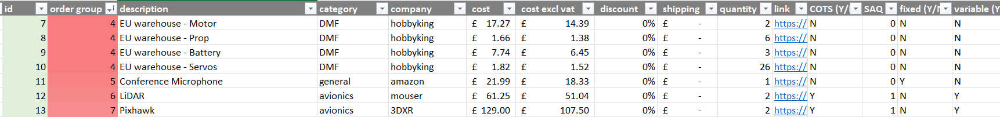

# Team Peryton Budget Tracker

a little script which generates University of Surrey "Purchase Request" forms from a single excel sheet, saving time needing to copy all the details over..

## Instructions

1. don't panic
2. install python (should work with 3.7+ but 3.10 to be safe)
3. pip install -r requirements.txt
4. COPY "config_base.json" to a file called "config.json"
5. Fill in the relevant details into "config.json"
6. COPY "procurement template.xlsx" into a file called "procurement.xlsx"
7. run "pyinstaller auto.py -F" to build the script into an EXE if desired
8. feel happy you don't need to fill in PR forms ever again : - )

## TODO
- do the data analysis in python
- make PR form format agnostic (enable editing of value positions in config.json)
